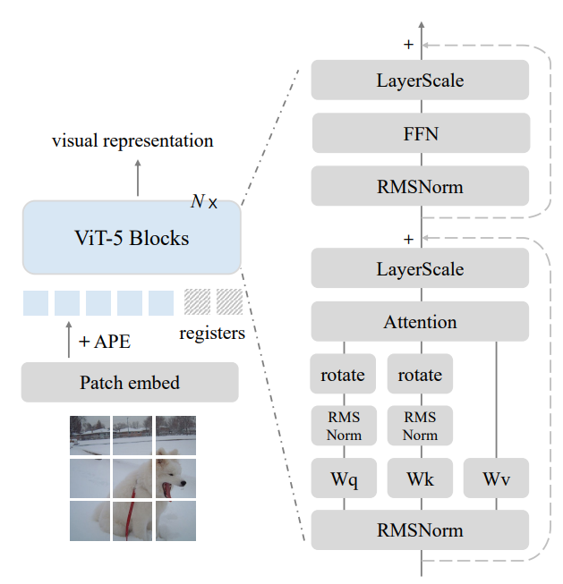
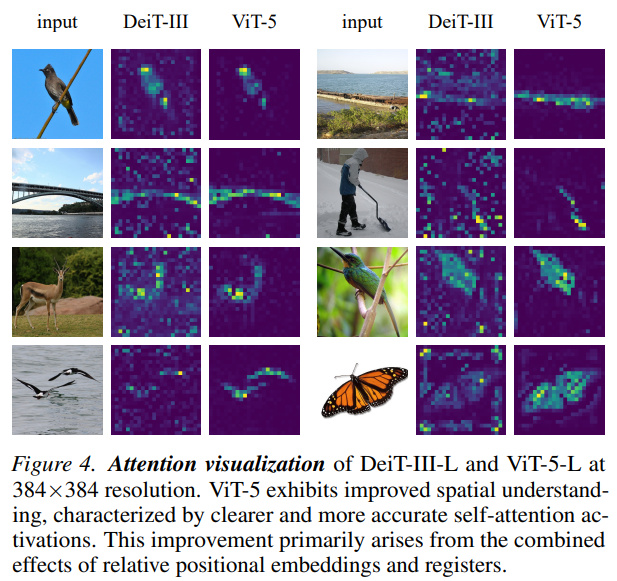
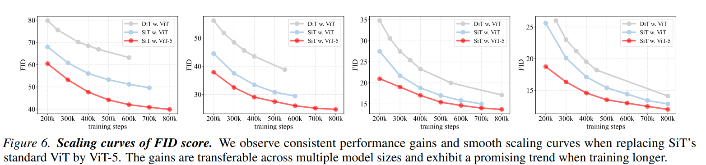

# ViT-5: Vision Transformers for the Mid-2020s

Official implementation of  
**ViT-5: Vision Transformers for the Mid-2020s**

📄 Paper: https://arxiv.org/abs/2602.08071  
🤗 Hugging Face: https://huggingface.co/FengWang3211/ViT-5  

---

## Overview

ViT-5 modernizes the canonical Vision Transformer architecture while preserving the clean Attention–FFN backbone design.

Rather than introducing a new paradigm, ViT-5 systematically upgrades core components of ViT using insights accumulated over the past several years in large-scale vision modeling.

It serves as:

- A strong ImageNet classification backbone  
- A scalable Transformer foundation  
- A drop-in upgrade for modern vision pipelines  
- A competitive backbone for generative modeling  

---

## Architecture

<p align="center">
  
  
</p>

ViT-5 keeps the standard Transformer encoder:

Patch Embedding → [Attention → FFN] × L → Head

but modernizes:

- Normalization  
- Positional encoding  
- Optimization recipe  
- Stabilization techniques  
- Training strategy  

Full details are described in the paper.

---

## Generative Modeling Impact

<p align="center">
  
</p>

ViT-5 also improves performance when used as a backbone in diffusion-style generative frameworks.

---

# Installation

## 1. PyTorch (CUDA 12.4)

```
pip install torch==2.4.1 torchvision --index-url https://download.pytorch.org/whl/cu124
```

## 2. Core Dependencies

```
pip install timm==0.4.12 numpy==1.26.4 wandb einops
```

## 3. NVIDIA Apex (for fused optimizers)

```
git clone https://github.com/NVIDIA/apex
cd apex
APEX_CPP_EXT=1 APEX_CUDA_EXT=1 pip install -v --no-build-isolation .
```

## 4. Flash Attention (Optional)

```
pip install flash-attn==2.6.3 --no-build-isolation
```

Flash Attention accelerates training but is not required.

---

# Training

## ImageNet Pretraining (8 GPUs Example)

### ViT-5-Small

```
torchrun --nproc_per_node 8 main.py \
--model vit5_small --input-size 224 \
--data-path YOUR_IMAGENET_PATH \
--output_dir DIR_TO_SAVE_LOG_AND_CKPT \
--batch 256 --accum_iter 1 --lr 4e-3 --weight-decay 0.05 \
--dist-eval --warmup-epochs 5 --eval-crop-ratio 1.0 --reprob 0.0 --smoothing 0.0 \
--epochs 800 --opt fusedlamb \
--mixup .8 --cutmix 1.0 --unscale-lr --disable_wandb \
--repeated-aug --bce-loss --color-jitter 0.3 --ThreeAugment --drop-path 0.05
```

---

# Fine-tuning

Example fine-tuning from a pretrained checkpoint:

```
torchrun --nproc_per_node 8 main.py \
--model vit5_small \
--finetune PATH_TO_YOUR_CKPT \
--data-path YOUR_DATASET_PATH \
--output_dir DIR_TO_SAVE_LOG_AND_CKPT \
--batch 64 --lr 1e-5 --weight-decay 0.1 --unscale-lr \
--reprob 0.0 --smoothing 0.1 --no-repeated-aug \
--aa rand-m9-mstd0.5-inc1 --epochs 20 --drop-path 0.05 \
--dist-eval --load_ema --disable_wandb --eval-crop-ratio 1.0
```

---

# Results

On ImageNet-1K:

- ViT-5-Base achieves **84.2% top-1 accuracy**

ViT-5 consistently outperforms earlier ViT baselines under comparable compute settings.

See the paper for full ablation and scaling results.

---

# Checkpoints

Pretrained weights are available at:

👉 https://huggingface.co/FengWang3211/ViT-5

---

# Citation

If you use ViT-5, please cite:

```
@article{wang2026vit5,
  title={ViT-5: Vision Transformers for The Mid-2020s},
  author={Wang, Feng and Ren, Sucheng and Zhang, Tiezheng and Neskovic, Predrag and Bhattad, Anand and Xie, Cihang and Yuille, Alan},
  journal={arXiv preprint arXiv:2602.08071},
  year={2026}
}
```

---

# Acknowledgement

This work builds upon the strong foundation of Vision Transformers and recent advances in scalable Transformer architectures. The code is basically built upon DeiT.

